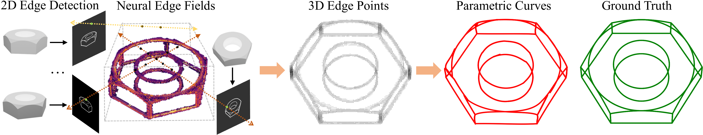

# NEF: Neural Edge Fields for 3D Parametric Curve Reconstruction from Multi-view Images

:star:PyTorch implementation of the paper:

NEF: Neural Edge Fields for 3D Parametric Curve Reconstruction from Multi-view Images [[arXiv]()] [[Project Page](https://yunfan1202.github.io/NEF/)].

[Yunfan Ye](https://yunfan1202.github.io), [Renjiao Yi](https://renjiaoyi.github.io/), [Zhirui Gao](), [Chenyang Zhu](http://www.zhuchenyang.net/), [Zhiping Cai](), [Kai Xu](http://kevinkaixu.net/index.html).


## Changelog 

* [February 2023] Initial release of code and dataset.


## Abstract

We study the problem of reconstructing 3D feature curves of an object from a set of calibrated multi-view images. To do so, we learn a neural implicit field representing the density distribution of 3D edges which we refer to as Neural Edge Field (NEF). Inspired by NeRF, NEF is optimized with a view-based rendering loss where a 2D edge map is rendered at a given view and is compared to the ground-truth edge map extracted from the image of that view. The rendering-based differentiable optimization of NEF fully exploits 2D edge detection, without needing a supervision of 3D edges, a 3D geometric operator or cross-view edge correspondence. Several technical designs are devised to ensure learning a range-limited and view-independent NEF for robust edge extraction. The final parametric 3D curves are extracted from NEF with an iterative optimization method. On our benchmark with synthetic data, we demonstrate that NEF outperforms existing state-of-the-art methods on all metrics.



## Enviroments
This code has been tested with Ubuntu 18.04, one 3080Ti GPU with CUDA 11.4, Python 3.8, Pytorch 1.12, and [Pytorch-lightning](https://github.com/Lightning-AI/lightning) 1.5.2.

:blush:*Earlier versions may also work~ :)*

## :evergreen_tree:Dataset

We introduce `ABC-NEF` dataset, which contains 115 distinct and challenging CAD models selected from [Chunk 0000](https://archive.nyu.edu/handle/2451/44309) of the [ABC dataset](https://cs.nyu.edu/~zhongshi/publication/abc-dataset/).

We apply [BlenderProc](https://github.com/DLR-RM/BlenderProc) to render multi-view images for each CAD model, and use pre-trained [PiDiNet](https://github.com/zhuoinoulu/pidinet) to detect 2D edges.

The rendered multi-view images and detected 2D edges are available at [Baidu Disk](https://pan.baidu.com/s/1c-UMN_rN5v_sVtJSqHeVPw?pwd=zapt) or [Google Drive](https://drive.google.com/file/d/1U8wbq28165SwPHVxUrFIcan4iHM8jD_7/view?usp=share_link).

The selected original `.obj` and `.feat` files are available at [Baidu Disk](https://pan.baidu.com/s/1EcZuBj1y3lOsLJ4eMkEMBw?pwd=5nq6 ) or [Google Drive](https://drive.google.com/file/d/1DmDi0QdfwZodXWXA-Nv8WRfTlBnIPsMO/view?usp=share_link).

The pre-trained models and results are available at [Baidu Disk](https://pan.baidu.com/s/12h0y9n2d76FUJoP4Dt6ZVw?pwd=mcmm) or [Google Drive](https://drive.google.com/drive/folders/1b8lvF7H_fq9kNydQc5uCbDiv0qMdTIOb?usp=share_link). 

## :punch:Usage
### Reconstructing 3D Edge Points
To train NEF for a scene, use the following command (example):

(See the pytorch-lighting implementation of NeRF at [nerf-pl](https://github.com/kwea123/nerf_pl) for reference).
```bash
python train.py \
--dataset_name blender \
--root_dir ABC_NEF_examples/00000006 \
--N_importance 64 --img_wh 400 400 --noise_std 0 \
--num_epochs 6 --batch_size 1024 \
--optimizer adam --lr 5e-4 --lr_scheduler steplr \
--decay_step 2 4 8 --decay_gamma 0.5 \
--exp_name 00000006
```
You can also directly run `train_command.py` to train NEFs, and monitor the training process by `tensorboard --logdir logs/` and go to `localhost:6006` in your browser.

We provide some pre-trained examples in `ckpts_ABC_examples`. To extract 3D edge points from trained NEF, use `parametric_curve/extract_point_cloud.py`. The results should be saved in `parametric_curve/ABC_point_clouds`.


### Extracting 3D Parametric Curves

To extract 3D parametric curves from the 3D edges, use `parametric_curve/curve_fitting.py`.  
We use [Chamfer Distance](https://github.com/ThibaultGROUEIX/ChamferDistancePytorch) for optimizing the curves. The result curves should be saved in `parametric_curve/ABC_curves_result`.

### Visualization and Evaluation

To visualize and evaluate extracted parametric curves, run `parametric_curve/visualize_and_eval_NEF.py`

Install [point_cloud_utils](https://github.com/fwilliams/point-cloud-utils) to perform evaluations on chamfer distance, precision, recall, F-score and IOU.

### Novel View Synthesis

Novel view synthesis is not necessary for 3D curves extraction. If there is a need to synthesize novel views of 2D edge maps based on trained NEF models (e.g. for making videos), run the following command:

```bash
python eval.py \
--root_dir ABC_NEF_examples/00000006 \
--dataset_name blender --img_wh 400 400 --N_importance 64\
--ckpt_path ckpts_ABC_examples/00000006/epoch=5.ckpt \
--scene_name 00000006
```
or directly run `eval_command.py`.
## Citation

```bibtex

```

## Acknowledgements

- [nerf-pl](https://github.com/kwea123/nerf_pl)
- [PIE-NET](https://github.com/wangxiaogang866/PIE-NET)
- [PC2WF](https://github.com/YujiaLiu76/PC2WF)
- [DEF](https://github.com/artonson/def)
- [Pytorch Chamfer Distance](https://github.com/ThibaultGROUEIX/ChamferDistancePytorch)
- [point_cloud_utils](https://github.com/fwilliams/point-cloud-utils)
